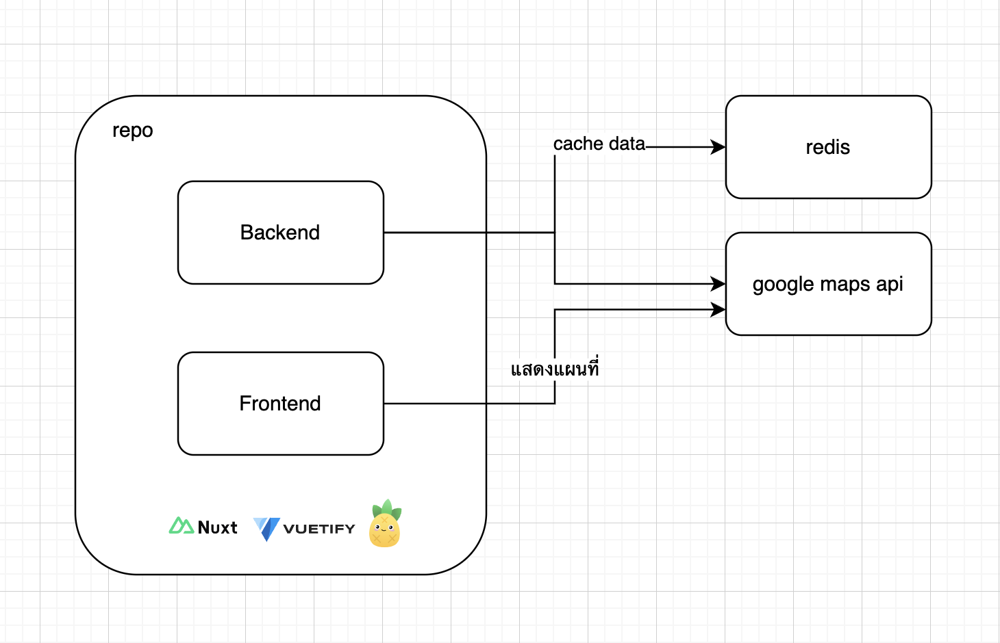
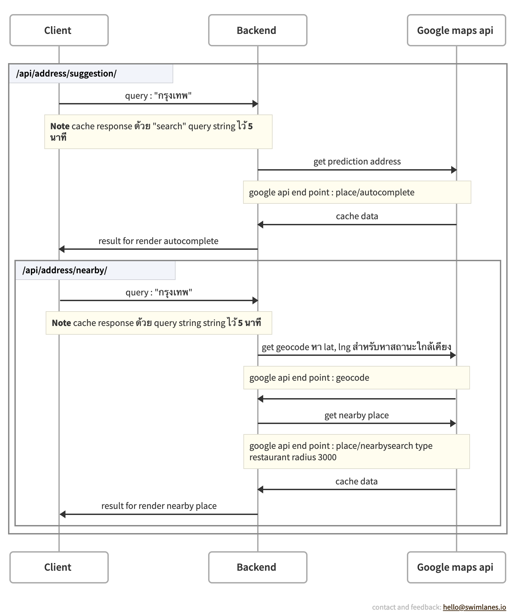

## Nearby restaurant

### How to run

1. `clone` .env.example -> .env

run dev mode

```bash
  ./dev.sh
```

run production mode

```bash
  ./production.sh
```

### Overview

tech stack (Nuxtjs, Redis, Google maps service)

#### system design

 system
architecture design


[swimlane](https://swimlanes.io/#tVO9TsMwEN79FKeMEVUqIZYMDDCw8Q4mOdKI1DaOM3QDgYS6IxAMDCCEBAs/quS8jR+Fc5wiiih0gCmWfff93cWUpsIUBHK9NxlorA1vNBeGMVZo2agUEq7KhOc5vdVJ3RQF1ZRSJGy7KlEYGGxu8ewARZ7CYYN6AilEzh47e+esdfbMtUfOXjp7EzEmpMGUxfEufeMYMp6NEAhYSVEjOHvu2qmzD87eQlSTpGwU9aC10aUowLWn/r2dQhxvUMOVs68d+iyOGeuFkCTYkbKoEMZc1UAGUijQgNKYl5lXD72huaQilFMleAAlS3KWgqp4hglvjMzkWFVokLEvyJ7sI4BgKOeGf9YSgkq90aYysC81HUWOGhaRv008TOa/014I+U+yLpCc5Z7mifqg4mYNKo9qH519625J8ouz16Giu7/oDkT07NqTzta91+g9kZYZKSWLvTFYMrOe+OdB/a4/5B42oCOEpYxhS0JD2FpmJqqLev43aZ6XTQ3rw+EQVt2g1VZoQSd7Bw==)
swimlane backend flow

project structure

| Type     | Name                       | Description                                                   |
| :------- | :------------------------- | :------------------------------------------------------------ |
| `folder` | `components`               | components สำหรับใช้ในส่วนต่างๆ                               |
| `folder` | `layouts`                  | layouts ทั้งหมด                                               |
| `folder` | `page`                     | page และ route ฝั่ง frontend                                  |
| `folder` | `store`                    | state managetment ไฟล์ store ต่างๆ (pinia)                    |
| `folder` | `server/*/**`              | folder ในนี้ทั้งหมดจะอยู่ในส่วนของ backend                    |
| `folder` | `server/api`               | route และ biz logic บ้างส่วน                                  |
| `folder` | `server/middleware`        | middleware                                                    |
| `folder` | `server/plugins`           | plugins มีใช้งานในส่วนของ storage (redis) สำหรับ cache ข้อมูล |
| `folder` | `server/service`           | service สำหรับเชื่อมต่อ google maps api                       |
| `folder` | `server/utils`             | validation, custom exception                                  |
| `file`   | `.env`                     | ไฟล์ env สำหรับ docker-compose.yaml                           |
| `file`   | `docker-compose.yaml`      | ไฟล์ สำหรับ run container api, mysql                          |
| `file`   | `docker-compose-dev.yaml`  | ไฟล์ docker-compose สำหรับ dev mode                           |
| `file`   | `docker-compose-prod.yaml` | ไฟล์ docker-compose สำหรับ prod mode                          |
| `file`   | `dev.sh`                   | ไฟล์ script สำหรับ run docker-compose ไฟล์ dev mode           |
| `file`   | `prod.sh`                  | ไฟล์ script สำหรับ run docker-compose ไฟล์ production mode    |

api endpoint

Postman Collection แนบตัวอย่าง Request, Response
[โหลดไฟล์](doc/nearby-restaurant.postman_collection.json) Postman Env
[โหลดไฟล์](doc/nearby-restaurant.postman_environment.json)

| Endpoint                   | Description                                              |
| :------------------------- | :------------------------------------------------------- |
| `/api/address/suggestion/` | สำหรับค้นหาที่อยู่ (cache 5 นาที)                        |
| `/api/address/nearby/`     | สำหรับค้นหา สถานที่ (ร้านอาหาร) ใกล้เคียง (cache 5 นาที) |
